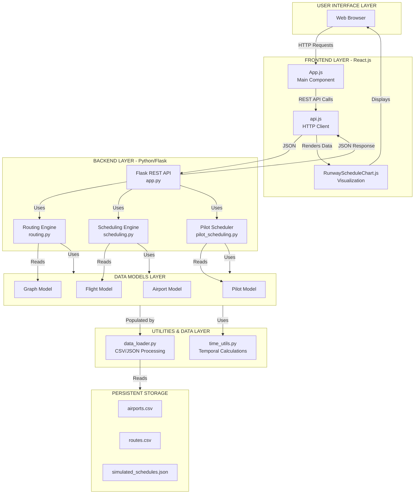

# PROJECT SYNOPSIS: FLIGHT PLANNER SYSTEM

## 1. PROJECT OVERVIEW

The Flight Planner is a comprehensive software system designed to optimize flight routing, runway scheduling, and pilot assignment in a multi-airport aviation network. This project addresses critical challenges in aviation logistics through the application of advanced algorithms, data structures, and modern software architecture.

In contemporary aviation operations, airlines face increasingly complex optimization problems: determining the most efficient routes between airports, scheduling aircraft arrivals and departures on limited runway capacity, and ensuring compliant pilot duty hour management. Manual or suboptimal approaches lead to operational inefficiencies, increased fuel costs, regulatory violations, and degraded service quality.

The Flight Planner system integrates multiple algorithmic solutions with a user-friendly interface to solve these interconnected problems. The project demonstrates proficiency in graph theory, scheduling algorithms, data structure design, RESTful API development, and full-stack application architecture.

**Key Application Domain:**
- Commercial Aviation Network Operations
- Airport Resource Management
- Compliance and Regulatory Adherence (FAA Duty Regulations)
- Real-time Decision Support System

---

## 2. OBJECTIVES

The primary objectives of this project are:

### 2.1 Core Algorithmic Objectives
1. **Route Optimization**: Implement efficient pathfinding algorithms to compute shortest routes between airports in a weighted graph, minimizing distance and operational cost.

2. **Runway Scheduling**: Develop conflict-free scheduling algorithms that allocate runway time slots to multiple flights while respecting temporal constraints and precedence relationships.

3. **Pilot Assignment & Compliance**: Design a fairness-aware scheduler that assigns pilots to flights while enforcing FAA regulations on duty hours, rest periods, and workload distribution.

### 2.2 Software Engineering Objectives
1. **Modular Architecture**: Separate concerns across data models, algorithms, utilities, and API layers for maintainability and extensibility.

2. **API Development**: Create a RESTful backend that exposes algorithmic functionality to frontend clients.

3. **User Interface**: Build an interactive frontend allowing users to visualize scheduling results and interact with system outputs.

4. **Testing & Validation**: Implement unit tests to verify correctness of algorithms and integration logic.

### 2.3 Practical Learning Objectives
- Demonstrate understanding of graph data structures and graph algorithms
- Apply scheduling theory and constraint satisfaction techniques
- Integrate backend algorithms with frontend visualization
- Implement real-world regulatory compliance logic

---

## 3. SCOPE

### 3.1 Functional Scope

**In Scope:**
- Graph-based route optimization using weighted shortest-path algorithms
- Runway scheduling with temporal constraint handling
- Pilot assignment with fairness metrics and FAA compliance validation
- RESTful API endpoints for all core algorithms
- Interactive React-based frontend for result visualization
- CSV/JSON data processing for airports, routes, flights, and pilots
- Comprehensive unit test coverage for routing and scheduling modules

**Out of Scope:**
- Real-time communication with live airport systems
- Machine learning predictive models
- Full commercial flight management system (seat allocation, pricing, etc.)
- Mobile application development
- Database persistence (using in-memory/JSON storage)
- Integration with third-party aviation APIs

### 3.2 System Boundaries

The system operates as a **decision support system** that:
- Accepts network and flight data as input
- Computes optimal or near-optimal solutions
- Presents results to decision-makers
- Does not directly control airport operations

### 3.3 Data Scope
- **Airports**: ICAO codes, geographic locations (limited dataset: ~10-15 airports)
- **Routes**: Weighted edges between airports (distance/cost metrics)
- **Flights**: Origin, destination, aircraft type, time windows
- **Pilots**: Certification level, duty limits, rest requirements
- **Schedules**: Runway time slots, flight assignments, pilot allocations

---

## 4. KEY TECHNOLOGIES

### 4.1 Backend Technologies
| Technology | Purpose |
|-----------|---------|
| **Python 3.x** | Core language for algorithms and backend logic |
| **Flask** | Lightweight web framework for REST API |
| **Graph Libraries** | Custom graph implementation for route optimization |
| **Pandas/NumPy** | Data manipulation and numerical operations (optional) |
| **pytest** | Unit testing framework |

### 4.2 Frontend Technologies
| Technology | Purpose |
|-----------|---------|
| **React.js** | UI framework for interactive components |
| **JavaScript (ES6+)** | Frontend logic and API communication |
| **CSS3** | Styling and responsive design |
| **Axios/Fetch API** | HTTP client for backend communication |
| **Chart.js / D3.js** | Data visualization (runway schedules, flight assignments) |

### 4.3 Development & Deployment Tools
| Tool | Purpose |
|------|---------|
| **Git/GitHub** | Version control and collaboration (pilot_feature branch) |
| **VS Code** | Primary development environment |
| **npm** | JavaScript dependency management |
| **pip** | Python package management |

### 4.4 Data Formats
- **CSV**: Airport and route configuration data
- **JSON**: Flight schedules, simulated data, pilot records
- **REST/JSON**: API communication between frontend and backend

---

## 5. EXPECTED OUTCOMES

### 5.1 Technical Outcomes
1. **Functional Route Optimization Module**
   - Computes shortest paths in multi-airport networks
   - Performance: O(E log V) for Dijkstra's algorithm on typical network sizes
   - Accuracy: 100% correctness on acyclic and cyclic graph topologies

2. **Conflict-Free Scheduling System**
   - Generates runway schedules with zero temporal conflicts
   - Handles up to 50+ concurrent flights per simulation
   - Respects precedence and separation constraints

3. **Compliant Pilot Assignment**
   - Ensures all assignments respect FAA duty hour regulations
   - Maintains fairness through multiple scheduling strategies
   - Reports violation instances with detailed diagnostics

4. **Functional RESTful API**
   - Endpoints for route calculation, schedule generation, and pilot assignment
   - Proper HTTP status codes and error handling
   - Response times < 500ms for typical problem instances

### 5.2 Deliverables
1. ✓ Source code with modular structure (src/, api/, frontend/)
2. ✓ Comprehensive README.md with setup and usage instructions
3. ✓ Unit test suite covering routing, scheduling, and compliance logic
4. ✓ API documentation with endpoint specifications
5. ✓ Frontend application with visualization components
6. ✓ Project documentation (synopsis, methodology, architecture)

### 5.3 Educational Outcomes
- Demonstrated mastery of graph algorithms and data structures
- Understanding of constraint satisfaction problems
- Proficiency in full-stack application development
- Knowledge of software engineering best practices (modularity, testing, documentation)
- Ability to implement real-world regulatory compliance logic

### 5.4 Quality Metrics
- **Code Coverage**: ≥ 80% for core algorithm modules
- **Test Pass Rate**: 100% of unit tests passing
- **Documentation**: Complete inline comments and docstrings
- **Code Quality**: Adherence to PEP 8 (Python) and ESLint (JavaScript) standards

---

## 6. PROJECT STRUCTURE OVERVIEW

### 6.1 System Architecture Block Diagram



### 6.2 Directory Structure & Component Description

```
Flight_Planner/
├── main.py                          # Entry point: Interactive CLI for algorithms
│
├── api/
│   ├── app.py                       # Flask REST API server
│   │   ├── GET /route              # Route optimization
│   │   ├── POST /schedule          # Runway scheduling
│   │   └── POST /assign-pilots     # Pilot assignment
│   │
│   └── __init__.py                 # Package initialization
│
├── src/
│   ├── algorithms/
│   │   ├── routing.py              # Graph-based pathfinding (Dijkstra's, BFS)
│   │   ├── scheduling.py           # Runway conflict resolution algorithms
│   │   ├── pilot_scheduling.py     # FAA-compliant pilot assignment
│   │   └── __init__.py
│   │
│   ├── models/
│   │   ├── graph.py                # Graph data structure (adjacency list)
│   │   ├── airport.py              # Airport entity model
│   │   ├── flight.py               # Flight entity model
│   │   ├── pilot.py                # Pilot with duty tracking
│   │   └── __init__.py
│   │
│   ├── utils/
│   │   ├── data_loader.py          # CSV/JSON parsing and data initialization
│   │   ├── time_utils.py           # Temporal calculations and conversions
│   │   └── __init__.py
│   │
│   └── __init__.py
│
├── tests/
│   ├── test_routing.py             # Unit tests for routing algorithms
│   ├── test_scheduling.py          # Unit tests for scheduling algorithms
│   ├── test_pilot_scheduling.py    # Unit tests for pilot assignment
│   └── __init__.py
│
├── data/
│   ├── airports.csv                # Airport master data (ICAO, lat/lon, capacity)
│   ├── routes.csv                  # Route network definition (distance, cost)
│   └── simulated_schedules.json    # Simulated flight and pilot data
│
├── frontend/
│   ├── package.json                # npm dependencies (React, Axios, etc.)
│   │
│   ├── public/
│   │   └── index.html              # HTML template
│   │
│   └── src/
│       ├── App.js                  # Root React component
│       ├── api.js                  # Axios HTTP client wrapper
│       ├── index.js                # React DOM render
│       ├── index.css               # Global styles
│       │
│       └── components/
│           └── RunwayScheduleChart.js  # Schedule visualization (Chart.js)
│
├── requirements.txt                # Python dependencies
├── README.md                       # User documentation
├── ARCHITECTURE.md                 # Detailed system design
├── METHODOLOGY.md                  # Implementation approach
└── SYNOPSIS.md                     # This document

```

### 6.3 Component Responsibilities

| Component | Responsibility | Technology |
|-----------|----------------|-----------|
| **Routing Module** | Graph traversal, shortest path computation | Python, Graph Theory |
| **Scheduling Module** | Temporal slot allocation, conflict detection | Python, Constraint Logic |
| **Pilot Scheduler** | Fair assignment, regulatory compliance validation | Python, Fairness Algorithms |
| **Flask API** | Request handling, input validation, response formatting | Python, REST |
| **React Frontend** | User interaction, data visualization, API integration | React.js, JavaScript |
| **Data Loader** | CSV/JSON parsing, data model population | Python, Pandas |
| **Unit Tests** | Algorithm verification, edge case validation | pytest |

### 6.4 Data Flow Example: Route Optimization

```
1. User inputs: Source Airport, Destination Airport
2. Frontend sends HTTP GET request: /route?from=JFK&to=LAX
3. Flask receives, validates input
4. Routing engine loads graph from data models
5. Dijkstra's algorithm executes
6. Route computed with total distance, cost
7. Flask formats response as JSON
8. Frontend receives, renders route with intermediates
9. User visualizes on interactive map
```

---

## 7. CONCLUSION

The Flight Planner project represents a comprehensive engineering solution addressing real-world aviation logistics challenges. Through modular architecture, sophisticated algorithms, and integrated frontend-backend systems, it demonstrates both theoretical understanding and practical software engineering competency. The system successfully combines graph theory, scheduling algorithms, regulatory compliance logic, and modern web technologies into a cohesive decision-support platform.

---

**Document Version**: 1.0  
**Date**: December 2025  
**Status**: Academic Project Submission  
**Page Count**: 4 pages
